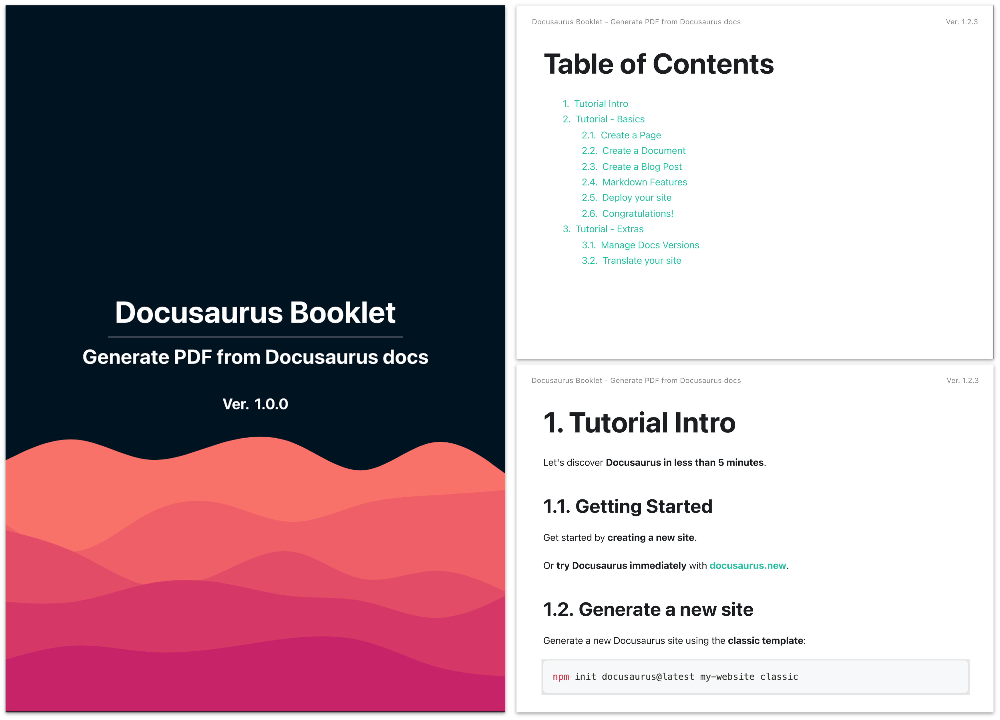
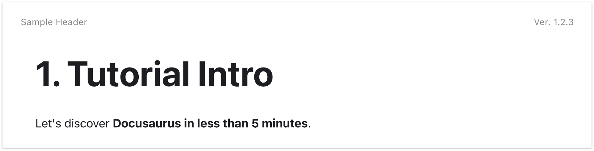

# docusaurus-booklet



`docusaurus-booklet` is a [Docusaurus](https://docusaurus.io/) plugin to generate PDF from docs.

<ul style="list-style-type: '✔️ '">
  <li>Generating cover page (Title / Subtitle / Background)</li>
  <li>Generateing table of contents from sidebar</li>
  <li>Auto section numbering</li>
</ul>


## 🚀 Quickstart

Step 1. Install plugin with:

```bash
npm install --save-dev docusaurus-booklet
```

Step 2. Add configuration to your `docusaurus.config.js`:

```javascript
module.exports = {
  // ... your config
  plugins: [
    [
      "docusaurus-booklet",
      {
        cover: {
          title: "Docusaurus Booklet",
          subtitle: "Generate PDF from Docusaurus docs"
        }
      }
    ]
  ]
}
```

Step 3. Build docusaurus pages:

```bash
# run build script
npm run build

# or run command directly 
npx docusaurus build
```

Step 4. Execute command with first page path:

```bash
npx docusaurus booklet /docs/intro
```

or add custom script to your `package.json`:

```json
{
  "scripts": {
    "your-script": "...",
    "booklet": "docusaurus booklet /docs/intro"
  }
}
```

```bash
npm run booklet
```

to output `docusaurus-booklet.pdf`. (See [CLI options](#cli-options) to change output file name)


## 🎨 Styling

### Cover Page

Cover page contents can be edited with the option `cover`,
and you can styling cover page with selector `#cover` in your custom CSS.

```javascript
module.exports = {
  // ... your config
  plugins: [
    [
      "docusaurus-booklet",
      {
        cover: {
          title: "Docusaurus Booklet",
          subtitle: "Generate PDF from Docusaurus docs",
          backgroundImage: "static/img/cover.svg",
          margin: {
            top: 0,
            right: 0,
            bottom: 0,
            left: 0,
          },
        }
      }
    ]
  ]
}
```

```css
/* custom.css */
#cover {
  color: #fff;
}
```

will output:


### Header

Header can be specified with option `header` like following:

```javascript
module.exports = {
  // ... your config
  plugins: [
    [
      "docusaurus-booklet",
      {
        cover: {
          title: "Docusaurus Booklet",
        },
      	header: {
          text: "Sample Header",
          version: true, // => shows 'version' in 'package.json'
          style: "color: #dcdcdc; font-size: 9px;"
      	}
      }
    ]
  ]
}
```

output:



#### Full-customized header

You can also use HTML snippet to specify custom header.

```javascript
module.exports = {
  // ... your config
  plugins: [
    [
      "docusaurus-booklet",
      {
        cover: {
          title: "Docusaurus Booklet",
        },
      	header: {
          html: `
            <style>
              .your-custom-header {
                width: 100%;
                text-align: center;
                color: #dcdcdc;
                font-size: 8px;
                font-family: system-ui;
              }
            </style>
          	<div class="your-custom-header">
          	  You can write anything!
          	</div>
          `
      	}
      }
    ]
  ]
}
```

will output:


### Footer

Footer can be specified with option `footer` same way as the option `header`:

```javascript
module.exports = {
  // ... your config
  plugins: [
    [
      "docusaurus-booklet",
      {
        cover: {
          title: "Docusaurus Booklet",
        },
      	footer: {
          text: "Sample Footer",
          pageNumber: true,
          style: "color: #dcdcdc; font-size: 9px; border-top: 1px solid #dcdcdc",
      	}
      }
    ]
  ]
}
```

will output:


#### Page number placeholder

The option `footer.pageNumber` can be a function that handling the placeholders:

```javascript
module.exports = {
  // ... your config
  plugins: [
    [
      "docusaurus-booklet",
      {
        cover: {
          title: "Docusaurus Booklet",
        },
      	footer: {
          text: "Sample Footer",
          pageNumber: (pageNumber, totalPages) => `${pageNumber} of ${totalPages}`,
          style: "color: #dcdcdc; font-size: 9px; border-top: 1px solid #dcdcdc",
      	}
      }
    ]
  ]
}
```

will output:


#### Full-customized footer

Footer option can also be a HTML snippet same as header.

```javascript
module.exports = {
  // ... your config
  plugins: [
    [
      "docusaurus-booklet",
      {
        cover: {
          title: "Docusaurus Booklet",
        },
      	footer: {
          html: `
            <style>
             .document-footer {
               width: 100%;
               text-align: center;
               color: #dcdcdc;
               font-size: 8px;
               font-family: system-ui;
             }
            </style>
            <div class="document-footer">
              <div>You can specify anything!</div>
              <div>
                <span class="pageNumber"></span> / <span class="totalPages"></span>
              </div>
            </div>
          `
      	}
      }
    ]
  ]
}
```

will output:


#### Header/Footer template limitations

Header/Footer can be specified arbitrary HTML snippet, but they have following limitations in its evaluation:

> 1. Script tags inside templates are not evaluated.
> 2. Page styles are not visible inside templates.

See details about limitations: [Puppeteer API](https://github.com/puppeteer/puppeteer/blob/main/docs/api.md#pagepdfoptions)

### Custom CSS

You can specify your custom CSS with the option `css`.

This option replace default CSS, so please see [default CSS](https://github.com/akebifiky/docusaurus-booklet/blob/main/assets/default.css) before using.


## 🛠️ Configuration

### CLI Options

```bash
# Usage
docusaurus booklet [options] <entry-point>
```

| Option               | Type       | Description                                                  |
| -------------------- | ---------- | ------------------------------------------------------------ |
| `-o` / `--output`    |            | Output PDF file path.<br />default: `docusaurus-booklet.pdf` |
| `--puppeteer-args`   | `string[]` | Chromium arguments (used in PDF generation)<br />See also: [Chromium docs](https://peter.sh/experiments/chromium-command-line-switches/) |
| `--cover-title`      | `string`   | Title in cover page<br />(this option overrides plugin options) |
| `--cover-subtitle`   | `string`   | Subtitle in cover page<br />(this option overrides plugin options) |
| `--cover-background` | `string`   | Background image path for cover page<br />(this option overrides plugin options) |

### Available Plugin Options

```typescript
type BookletPluginOptions = {
  /** Cover page options */
  cover: {
    /** Cover page title */
    title: string;

    /** Cover page subtitle */
    subtitle?: string;

    /** background image path */
    backgroundImage?: string;

    /**
     * PDF content margin for cover page (same as puppeteer option)
     * If not specified, BookletPluginOptions.margin is used
     */
    margin?: PDFMargin;
  };

  /** 
   * TOC (Table of Contents) options,
   * or set 'false' to disable TOC page
   */
  toc?: { title: string } | false;

  /** 
   * PDF format (same as puppeteer option)
   * default: 'a4'
   */
  format?: PaperFormat;

  /** PDF content margin (same as puppeteer option) */
  margin?: PDFMargin;

  /**
   * User-custom CSS file path for PDF
   * default: (see 'Default Styles' section)
   */
  css?: string;

  /**
   * PDF header options (disable if false)
   *
   * Please see Puppeteer options to use HTML fragment option
   * https://github.com/puppeteer/puppeteer/blob/main/docs/api.md#pagepdfoptions
   */
  header?: HeaderOptions | HTMLFragmentOption | false;

  /**
   * PDF footer options (disable if false)
   *
   * Please see Puppeteer options to use HTML fragment option
   * https://github.com/puppeteer/puppeteer/blob/main/docs/api.md#pagepdfoptions
   */
  footer?: FooterOptions | HTMLFragmentOption | false;

  /** Enable/Disable section numbering */
  autonumber?: boolean;

  /** Content selectors */
  selectors?: {
    /** Main content selector */
    mainContent?: string;

    /** Next page link selector */
    pagination?: string;

    /** Sidebar content selector */
    sidebar?: string;

    /** Excluding content selectors */
    exclude?: string[];
  };
}

/**
 * Options for PDF header
 */
type HeaderOptions = {
  /** Header text */
  text?: string;

  /** Show/Hide version */
  version?: boolean;

  /** Additional styles for header (such as 'font-size', 'color', etc.) */
  style?: string;
};

/**
 * Options for PDF footer
 */
type FooterOptions = {
  /** Footer text */
  text?: string;

  /** Show/Hide page number, or text generator that generates from placeholders */
  pageNumber?: boolean | ((pageNumber: string, totalPages: string) => string);

  /** Additional styles for footer (such as 'font-size', 'color', etc.) */
  style?: string;
};

/**
 * Option to specify HTML template
 */
export type HTMLFragmentOption = {
  /** HTML template */
  html: string;
};
```

### Default Plugin Options

Following options are used in default:

```javascript
const defaultPluginOptions = {
  cover: {
    title: process.env.npm_package_name || "Docusaurus Booklet",
  },
  toc: {
    title: "Table of Contents",
  },
  format: "a4",
  margin: {
    top: "0.7in",
    right: "0.4in",
    bottom: "0.7in",
    left: "0.4in",
  },
  autonumber: true,
  selectors: {
    mainContent: "article",
    pagination: ".pagination-nav__item--next > a",
    sidebar: ".theme-doc-sidebar-menu",
    exclude: ["nav.navbar,footer.footer,.theme-doc-toc-mobile"],
  },
  footer: {
    text: authorName ? `Copyright ${new Date().getFullYear()} ${packageAuthorName} All Rights Reserved.` : "",
    pageNumber: true,
  },
}
```

### Typing Config

You can use the exported type definitions in [JSDoc type annotation](https://www.typescriptlang.org/docs/handbook/jsdoc-supported-types.html):

```javascript
module.exports = {
  // ... your config
  plugins: [
    [
      "docusaurus-booklet",
      /** @type {import("docusaurus-booklet").BookletPluginOptions} */
      ({
        cover: {
          title: "Docusaurus Booklet",
          subtitle: "Generate PDF from Docusaurus docs"
        }
      })
    ]
  ]
}
```


## 💡 Remarks

- This plugin does not support Docusaurus v1
- This plugin uses [Puppeteer](https://github.com/puppeteer/puppeteer) to generate PDF from HTML,
  please check your [environment settings](https://github.com/puppeteer/puppeteer/blob/main/docs/troubleshooting.md) before using.